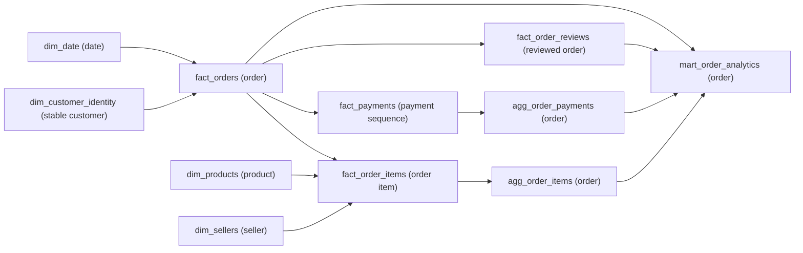

# Phase 4 Analytical Model

DuckDB 1.4.5 builds a grain-safe local database at `data/interim/olist_analytics.duckdb`. Rebuild with `python src/data/build_analytical_model.py`.

Facts remain separate; the mart joins only one-row-per-order aggregates. Customer geography is order-associated, while the stable identity dimension has no chosen home location. Review events are preserved and summarized by order mean. Products use a left translation join with `Unknown Category` or original Portuguese untranslated labels. Raw geolocation normalization is deferred because state/city needs are already supported without fanout.

The DuckDB file is a rebuildable interim artifact and is not committed. Native facts are authoritative for reconciliation; the mart is a convenience layer.

## Optional relationships: NULL versus zero

`mart_order_analytics` uses left joins from `fact_orders` to independently aggregated item, payment, and review tables. It does not `COALESCE` optional numeric fields. Consequently:

| Fields | No related source row | Genuine observed zero | Relationship indicator |
|---|---|---|---|
| `item_count`, `product_gmv`, `freight_value`, `gross_order_value` | `NULL` | Preserved as zero where source item facts produce zero | `has_items` |
| `payment_record_count`, `recorded_payment_value` | `NULL` | Preserved as zero where payment records exist but sum to zero | `has_payment` |
| `review_event_count`, `mean_review_score` | `NULL` | A missing review never becomes score zero | `has_review` |

The current build contains 775 orders without items, one without payments, and 768 without reviews. Their corresponding optional aggregates are `NULL`. Genuine observed zeros remain distinct: 338 order aggregates have zero freight and three payment-bearing order aggregates have zero recorded payment value. Eligibility is determined from the approved status, endpoint, and relationship flags—not by testing a `COALESCE`d monetary or score value.

## Date dimension coverage

`dim_date` contains 800 contiguous calendar dates from 2016-09-04 through 2018-11-12. The lower bound is the earliest observed `order_purchase_timestamp`; the upper bound is the later of the maximum estimated-delivery date and maximum customer-delivery date. Dates after the final purchase date are intentional so supported secondary delivery-date roles remain covered. Primary metric attribution remains `order_purchase_timestamp`; this wider calendar does not change the Phase 3 attribution policy.

## Metric-population safety

The mart has no universal metric-eligibility flag. Future queries must apply the population assigned to each metric in the authoritative metric contract:

| Metrics | Required mart population control |
|---|---|
| MET-001 | All `fact_orders`/mart rows; do not apply a status filter |
| MET-002 | `is_delivered_status` |
| MET-003–MET-007, MET-011–MET-013 | `is_commercially_eligible`, plus the applicable fact/relationship fields required by the metric |
| MET-008 | `is_delivery_metric_eligible` |
| MET-009, MET-015 | Approved delivered endpoint population represented by `is_delivery_metric_eligible` and the non-null late/on-time indicators |
| MET-010 | `has_review`, using `mean_review_score` at one row per reviewed order |
| MET-014 | `has_payment`, under the metric contract's approved status policy |

These flags expose structural eligibility but do not replace the formulas, filters, null handling, or caveats in `specs/04-metric-contract.md`.
